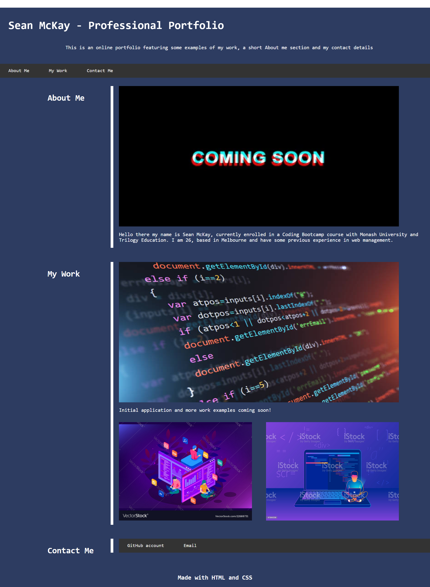

# 02 Advanced CSS: Portfolio

This project features the layout and beginning of an online portfolio that I hope to fill with future deployed projects and information.
Some current inclusions in the project are
    - Operational navigation bar
    - Containers and spacing setup with placeholder images to be updated with my own projects (with links)
    - Buttons to contact me via GitHub or Email
    - Short About me section
    - Responsive layout and display for different sized viewports

